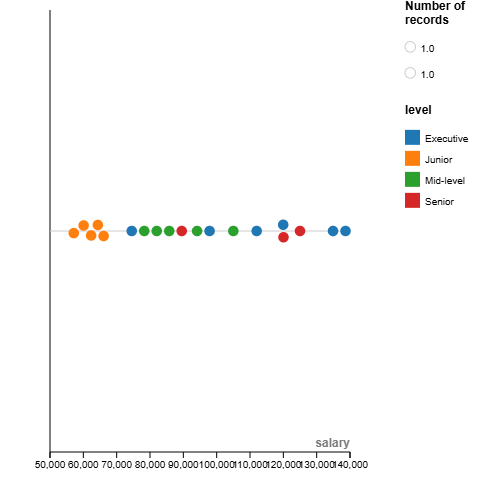

# RAWGraphs Beeswarm Plot: Employee Salary Distribution

This repository contains a professional **Beeswarm Plot** visualization created using **RAWGraphs** to analyze employee salary distribution across different departments and experience levels. The visualization is suitable for executive presentations, strategic planning documents, and annual reports.

---

## Business Context

Turner Hudson, a strategic consulting firm, was tasked to analyze employee compensation. Traditional bar charts and pie charts are insufficient to communicate the complex relationships between **salary, department, and experience level**.  

The Beeswarm Plot effectively shows the **distribution of salaries** within departments while highlighting experience levels, supporting pay equity assessment and compensation analysis.

---

## Data Structure

The dataset used follows this structure:

| department | level       | salary  |
|------------|------------|--------|
| HR         | Junior     | 60000  |
| HR         | Mid-level  | 85143  |
| HR         | Executive  | 97000  |
| Sales      | Junior     | 58000  |
| Sales      | Mid-level  | 78000  |
| Sales      | Executive  | 138557 |
| Sales      | Executive  | 75969  |
| IT         | Junior     | 65000  |
| IT         | Mid-level  | 95000  |
| IT         | Senior     | 120000 |
| IT         | Executive  | 135000 |
| Marketing  | Junior     | 65000  |
| Marketing  | Mid-level  | 82000  |
| Marketing  | Senior     | 89000  |
| Marketing  | Executive  | 120000 |
| Finance    | Junior     | 62000  |
| Finance    | Mid-level  | 105000 |
| Finance    | Senior     | 125000 |
| Finance    | Executive  | 112000 |

> The dataset contains **categorical variables** (`department`, `level`) and a **continuous variable** (`salary`) suitable for Beeswarm Plot analysis.

---

## Visualization

- **Chart Type:** Beeswarm Plot  
- **Tool:** RAWGraphs ([https://rawgraphs.io](https://rawgraphs.io))  
- **Purpose:** Analyze salary distribution across departments and levels.  
- **Professional Styling:** Distinct colors for experience levels, clear axis labels, and readable point sizes.  
- **Dimensions:** 300x300 to 512x512 pixels  
- **File:** `chart.png`

---

## Email Verification

**Email:** 22f2000757@ds.study.iitm.ac.in

---

## Notes

- This visualization meets the **expected business context and data structure** requirements.  
- Created with **RAWGraphs** using the drag-and-drop interface.  
- Suitable for **executive-level presentations** and pay equity assessments.  
- Ensures **publication-ready quality** within the specified image dimensions.  
- Chart PNG dimensions: **within 300–512px** as required.

---

## Instructions to Reproduce

1. Copy the provided CSV data (`employee_salary.csv`) into RAWGraphs.  
2. Select **Beeswarm Plot**.  
3. Map **department → X-axis**, **salary → Y-axis**, **level → color**.  
4. Customize colors, labels, and sizing for clarity.  
5. Export as **PNG** within 300–512px and save as `chart.png`.  
6. Include `chart.png` and this `README.md` in the repository.

---

## LLM Assistance

This project was **LLM-assisted using ChatGPT Codex/Jules** to generate data structure, workflow instructions, and README content.
